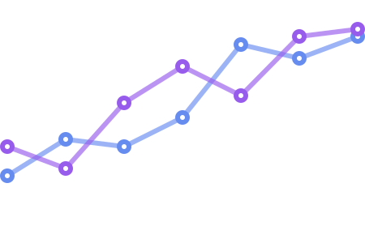

    

        
    

    

            
    

    
    <h2 align="left" font-weight="bold">About me</h2>
    
I’m a developer who has passion for building clean web applications with intuitive functionality. I enjoy the process of turning ideas into reality using creative solutions. I’m always curious about learning new skills, tools, and concepts. In addition to working on various solo full stack projects, I have worked with creative teams, which involves daily stand-ups and communications, source control, and project management.

    

        <h1 align="center"></h1>
        
        
        
         
        <h2 font-weight="bold">Skill set</h2>
        <table>
            <tr>
                <td></td>
                <td></td>
                <td></td>
                <td></td>
            </tr>
        </table>
         
        <h3 align="center" >Connect with me</h3>
        

            

                
                
                
                
                
                
            

        

    

